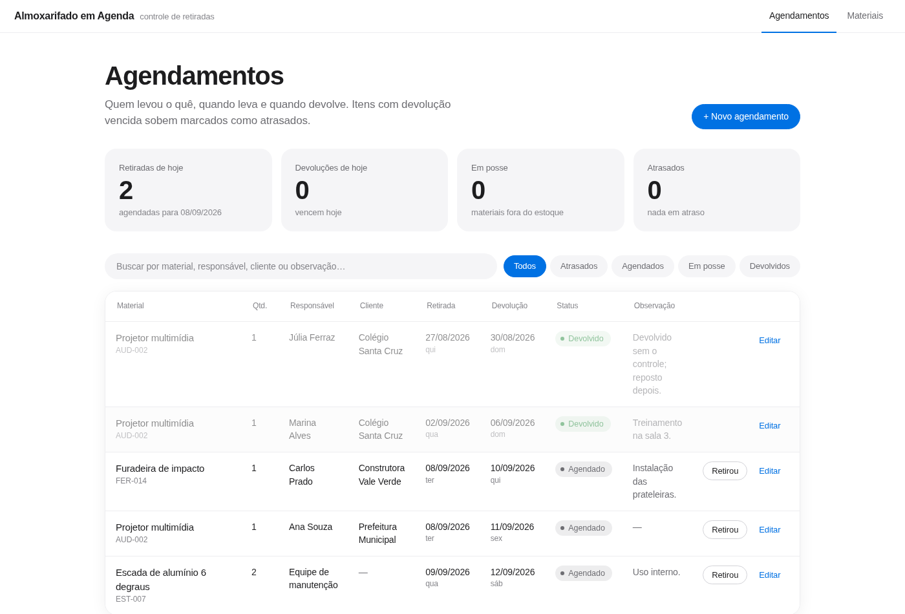
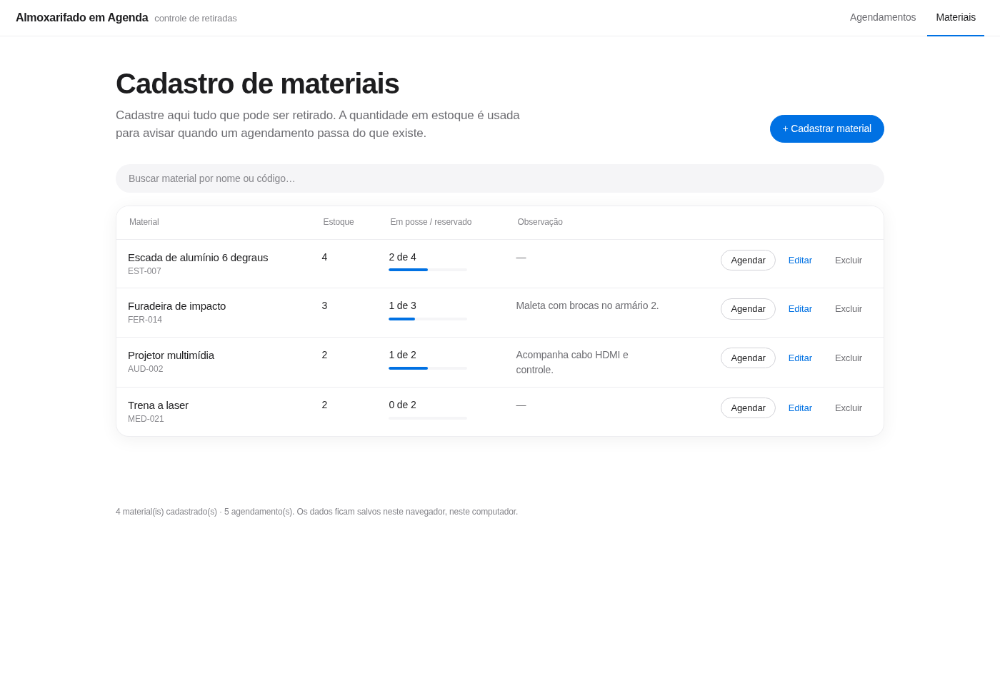

# Reserva HUB

Controle de retirada e devolução de materiais: cadastro dos itens, agendamento por período, responsável, cliente e marcação automática de atrasos. Feito com React, TypeScript e Vite, sem back-end — os dados ficam no navegador de quem usa.



## O que ele resolve

Quem empresta equipamento — almoxarifado, escola, locadora, equipe de campo — costuma controlar isso em planilha, e a planilha não avisa quando um item passou da data nem impede reservar três projetores quando só existem dois. O app cobre esses dois pontos:

- **Atraso é calculado, não digitado.** Todo agendamento que ainda não voltou e passou da data de devolução aparece como *Atrasado*, com quantos dias, sem ninguém precisar marcar nada.
- **Disponibilidade por período.** Ao agendar, o app soma o que já está comprometido naquelas datas e avisa quando a quantidade pedida passa do estoque cadastrado.

## Funcionalidades

- Cadastro de materiais com nome, código/patrimônio, quantidade em estoque e observação
- Agendamento com material, quantidade, responsável, cliente, data de retirada, data de devolução, status e observação
- Status *Agendado → Retirado → Devolvido*, com botões de um clique na própria linha
- Painel do dia: retiradas de hoje, devoluções de hoje, itens em posse e atrasados
- Busca por material, responsável, cliente ou observação, e filtros por status
- Sugestão automática de clientes já cadastrados
- Barra de ocupação por material (quanto está fora do estoque)
- Tema claro e escuro, seguindo a preferência do sistema
- Dados salvos no `localStorage`, sem necessidade de servidor ou login



## Stack

| Camada | Escolha |
| --- | --- |
| Interface | React 19 + TypeScript |
| Build | Vite |
| Estilo | CSS puro com variáveis (temas claro/escuro) |
| Persistência | `localStorage` do navegador |
| Deploy | GitHub Actions → GitHub Pages |

## Como rodar

Requer Node.js 20 ou superior.

```bash
git clone https://github.com/<seu-usuario>/agendamento-materiais.git
cd agendamento-materiais
npm install
npm run dev
```

O app sobe em `http://localhost:5173`. Na primeira tela há o botão **Carregar dados de exemplo**, útil para ver tudo funcionando antes de cadastrar os seus itens.

Outros comandos:

```bash
npm run build     # gera a versão de produção em dist/
npm run preview   # serve o que foi gerado em dist/
npm run lint      # análise estática com oxlint
```

## Estrutura

```
src/
├── App.tsx                  # composição das telas, abas, filtros e diálogos
├── index.css                # identidade visual e temas
├── types.ts                 # Material, Agendamento, Status
├── lib/
│   ├── datas.ts             # datas em ISO, formatação e diferença em dias
│   ├── regras.ts            # regras de negócio (atraso, disponibilidade, filtros)
│   └── armazenamento.ts     # leitura e gravação no localStorage
├── hooks/
│   └── useAlmoxarifado.ts   # estado da aplicação e ações que o alteram
├── data/
│   └── exemplos.ts          # dados fictícios para demonstração
└── components/              # componentes de tela (tabelas, formulários, painel)
```

As regras de negócio ficam em `src/lib/regras.ts`, separadas da interface: são funções puras que recebem os dados e devolvem o resultado, o que facilita testar e reaproveitar caso o projeto ganhe um back-end depois.

## Decisões de implementação

- **Datas como texto ISO (`AAAA-MM-DD`).** Comparar `"2026-09-08" < "2026-09-10"` é comparação de texto e não sofre com fuso horário — problema clássico ao usar `Date` para representar um dia do calendário.
- **Status derivado.** *Atrasado* não é gravado; é calculado a partir da data de devolução e do status atual. Não existe estado inconsistente para corrigir.
- **Estado em um hook só.** `useAlmoxarifado` concentra os dados e as ações, e grava no navegador a cada alteração. Sem biblioteca de estado global para um app deste tamanho.
- **Leitura tolerante a falhas.** Aba anônima, armazenamento bloqueado ou JSON corrompido devolvem dados vazios em vez de quebrar a tela.

## Deploy

O workflow em `.github/workflows/deploy.yml` publica no GitHub Pages a cada push na `main`. Para ativar:

1. No repositório, vá em **Settings → Pages** e, em *Source*, escolha **GitHub Actions**.
2. Dê push na `main`. O site fica em `https://<seu-usuario>.github.io/<nome-do-repositorio>/`.

O caminho base do build é ajustado automaticamente pelo workflow, através da variável `BASE_PATH`.

## Limitações conhecidas

- Os dados são de um navegador só: não há sincronização entre pessoas ou dispositivos. Um back-end com API e banco resolveria, e as regras em `src/lib/regras.ts` seriam reaproveitadas.
- Não há autenticação nem histórico de alterações.

## Licença

MIT — veja [LICENSE](LICENSE).
